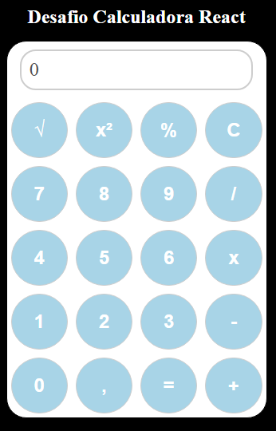

# Projeto Calculadora React

Este projeto é uma aplicação simples de calculadora desenvolvida utilizando React e styled-components para o curso React Developer da Dio.

## Proposição do projeto

- Calculadora capaz de realizar: adição, subtração, multiplicação e divisão.

## Desafio Pessoal

- Adicionar funcionalidades: Porcentagem, Raiz quadrada e Elevar a potência de 2.

## Link do projeto online

